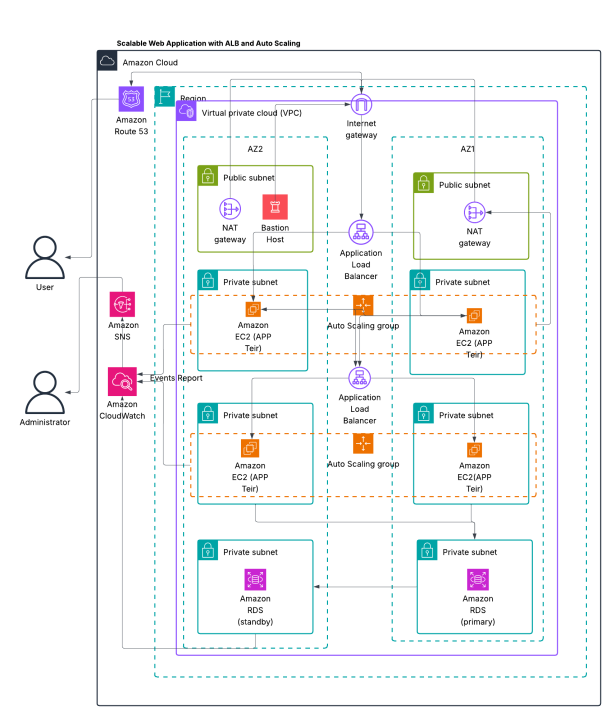

# AWS-Architecture-Scalable-Web-Application
## High-level overview:

## Table of Contents
- [Project Overview](#1-project-overview)
- [Key AWS Services](#2-key-aws-services)
- [Architecture Enhancements and Design Considerations](#3-architecture-enhancements-and-design-considerations)
- [IAM Roles & Policies](#4-iam-roles--policies)
- [Security Groups Configuration](#5-security-groups-configuration)
- [System Flow — A Journey Through the Application](#6-system-flow--a-journey-through-the-application)
- [Key Architectural Notes](#7-key-architectural-notes)
- [Conclusion](#conclusion-engineering-for-scale-and-reliability)

---

## 1. Project Overview

In a world where scalability and reliability are non-negotiable, building a resilient web application architecture is a challenge worth mastering. This project represents a blueprint for deploying a scalable, highly available web application on AWS, designed to seamlessly handle variable traffic loads while maintaining optimal performance and security standards.

At its core, the architecture leverages the elasticity of AWS services to ensure that the application remains accessible and efficient under any circumstances. Every component, from compute to networking to database, is carefully orchestrated to build an infrastructure that not only scales but also heals itself when failures occur.

---

## 2. Key AWS Services

This solution harnesses several AWS services, each playing a crucial role in achieving a production-grade, scalable system:

- **EC2 (Elastic Compute Cloud):** Serves as the compute backbone, hosting web and application servers.
- **Application Load Balancer (ALB):** Smartly distributes incoming web traffic across multiple EC2 instances, ensuring high availability.
- **Auto Scaling Group (ASG):** Dynamically adjusts the number of EC2 instances based on real-time demand, enabling cost optimization without compromising performance.
- **Amazon RDS (Relational Database Service):** Provides a reliable, multi-AZ MySQL/PostgreSQL database backend, ensuring data durability and automated failover.
- **IAM (Identity and Access Management):** Enforces the principle of least privilege by assigning precise, role-based permissions to AWS resources.
- **CloudWatch:** Monitors resource health and performance metrics; integrated with **SNS (Simple Notification Service)** to proactively alert administrators on critical events.
- **Route 53:** (Optional for DNS Management) Resolves domain names to ALB endpoints, enabling user-friendly access.

---

## 3. Architecture Enhancements and Design Considerations

- **Bastion Host:** A secure gateway for administrators to access private subnets without exposing the environment to the public internet.
- **NAT Gateway:** Allows instances in private subnets to securely connect to the internet for updates, while denying unsolicited inbound connections.
- **Multi-AZ Deployment for RDS:** Ensures minimal downtime and high availability with automated failover.
- **Security First:** Designed with VPC-level isolation, security groups, and minimal attack surface exposure.

---

## 4. IAM Roles & Policies

Following AWS best practices for least privilege, specific service-linked roles were configured:

| Service          | IAM Policy                                 |
| ---------------- | ------------------------------------------ |
| ALB              | `AWSElasticLoadBalancingServiceRolePolicy` |
| ASG              | `AWSServiceRoleForAutoScaling`             |
| CloudWatch       | `CloudWatchReadOnlyAccess`                 |

Each role is assigned to its respective service to automate resource management securely and efficiently.

---

## 5. Security Groups Configuration

Network access is meticulously controlled through security groups acting as virtual firewalls:

| **Component**       | **Inbound Rules**                              | **Outbound Rules**                          |
| ------------------- | ---------------------------------------------- | ------------------------------------------- |
| **ALB (Web Tier)**   | 0.0.0.0/0 on ports 80 (HTTP), 443 (HTTPS)      | EC2 Subnet CIDR ranges on 80/443            |
| **Web EC2 Instances**| ALB Web Tier IPs on 80, 443                   | ALB App Tier IPs on 5000                    |
| **ALB (App Tier)**   | Web EC2 Subnet CIDRs on port 5000              | App EC2 Subnet CIDRs on 5000                |
| **App EC2 Instances**| App Tier ALB IPs on 5000                      | RDS Subnet CIDRs on 3306                    |
| **RDS (Database)**   | App Tier Subnet CIDRs on port 3306             | -                                           |

> **Note:** No resource is directly exposed to the public except the Web Tier ALB, ensuring a strong perimeter defense.

---

## 6. System Flow — A Journey Through the Application

Let’s walk through the life of a request in this architecture:

1. **User Initiates Request:** An external user enters the domain name in their browser.
2. **DNS Resolution:** **Route 53** resolves the domain to the **Web Tier ALB**’s public IP.
3. **Internet Gateway:** The request flows through the VPC’s Internet Gateway to reach the public ALB.
4. **Load Balancing at Web Tier:** The ALB distributes the incoming traffic across the EC2 instances in the **Web Auto Scaling Group**.
5. **Auto Scaling:** The ASG monitors application load:
   - **Scale-Out:** Increases instances when demand spikes.
   - **Scale-In:** Decreases instances during low demand to optimize cost.
6. **Request Forwarding:** If needed, the Web Tier forwards application-related traffic to the **App Tier ALB** (private).
7. **Load Balancing at App Tier:** The App Tier ALB, invisible to the internet, balances load across App Tier EC2 instances.
8. **Database Interaction:** The App Tier servers interact with **Amazon RDS** to query or update data.
9. **Resilience:** In case of a database failure, **Multi-AZ** replication ensures automatic failover with minimal disruption.
10. **Monitoring & Alerts:** 
    - **CloudWatch** monitors EC2 and RDS events like instance launch/termination or RDS failover.
    - Alarms trigger **SNS** notifications, sending email alerts to administrators for immediate awareness and action.

---

## 7. Key Architectural Notes

- **High Availability:** Achieved through multi-AZ setups and auto scaling.
- **Security Best Practices:** No direct SSH access to production servers; access is only via Bastion Host.
- **Cost Optimization:** Auto scaling reduces costs during low usage periods.
- **Operational Visibility:** CloudWatch and SNS ensure real-time awareness of system health and performance.

---

# Conclusion: Engineering for Scale and Reliability

This project isn’t just about building a web application — it's about architecting a *resilient, scalable, secure* environment where applications thrive under unpredictable conditions. Through a combination of AWS services and best practices, we created an infrastructure that can adapt, heal, and perform — with minimal human intervention.
